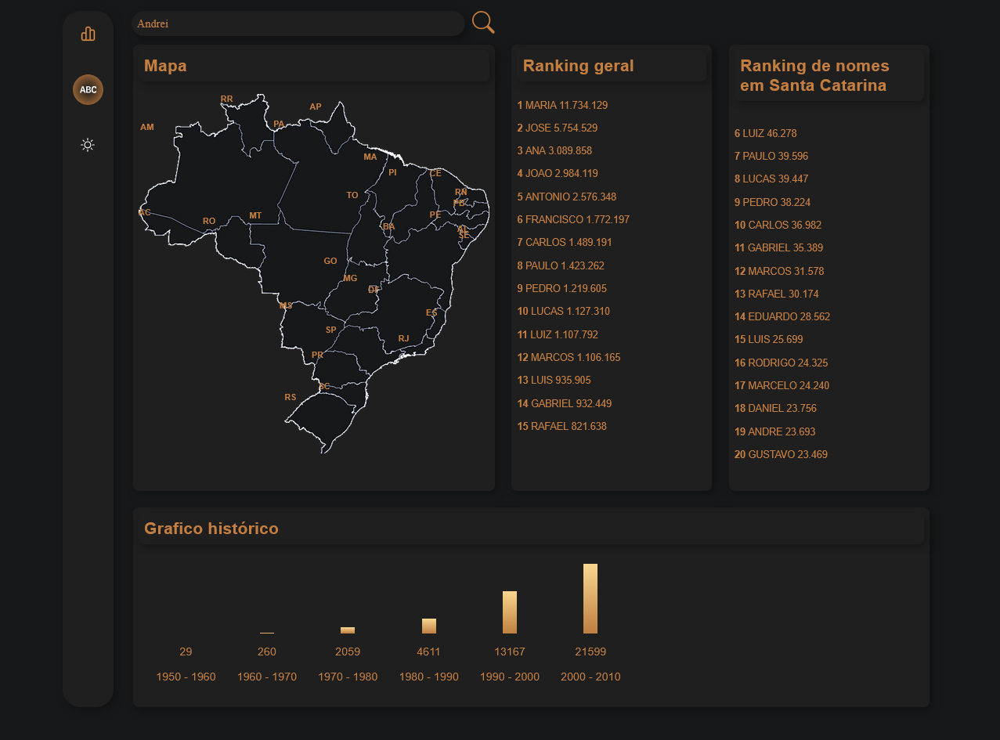
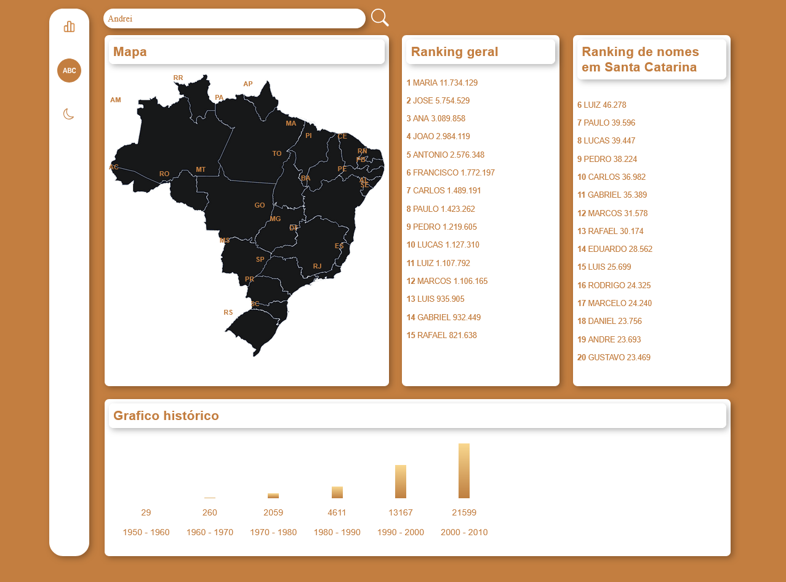

# Dashboard Vue

Este projeto é um **dashboard interativo** desenvolvido com Vue.js para análise de dados da [API de Nomes do IBGE](https://servicodados.ibge.gov.br/api/docs/nomes?versao=2#api-_). A aplicação permite explorar estatísticas sobre a **frequência do seu nome ao longo das últimas décadas**, bem como visualizar o **ranking dos nomes mais comuns no Brasil e por estado**.

## Preview

### 🌙 Tema Escuro



### ☀️ Tema Claro



## Project setup
```
npm install
```

### Compiles and hot-reloads for development
```
npm run serve
```

### Compiles and minifies for production
```
npm run build
```

### Lints and fixes files
```
npm run lint
```

### Customize configuration
See [Configuration Reference](https://cli.vuejs.org/config/).
